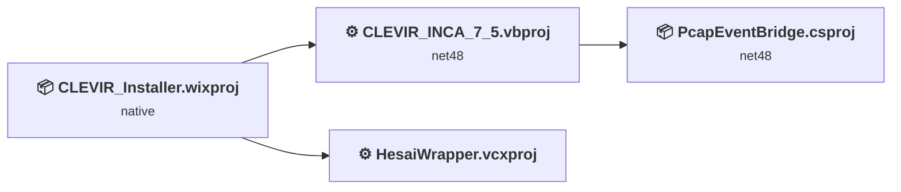
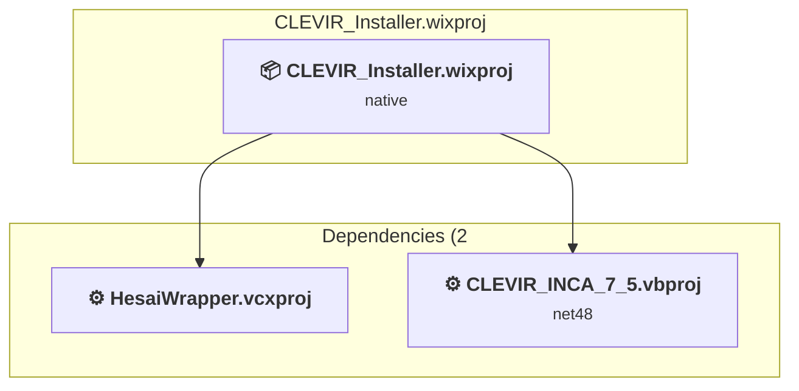
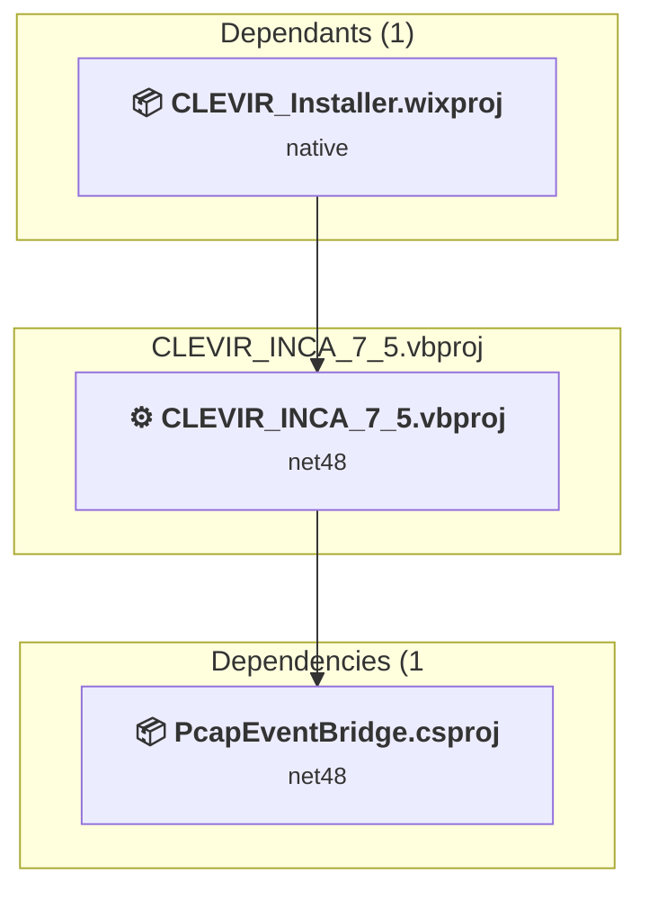
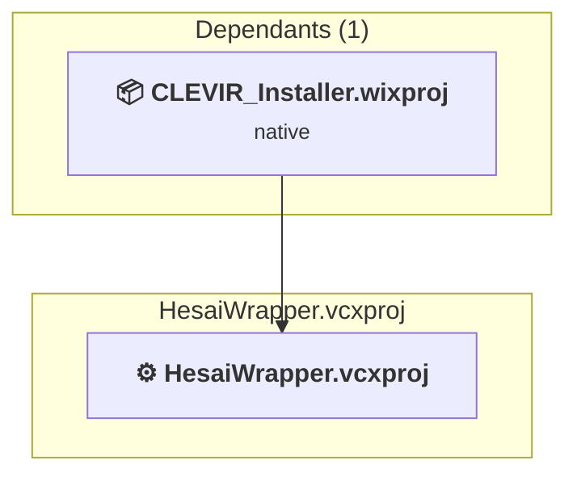
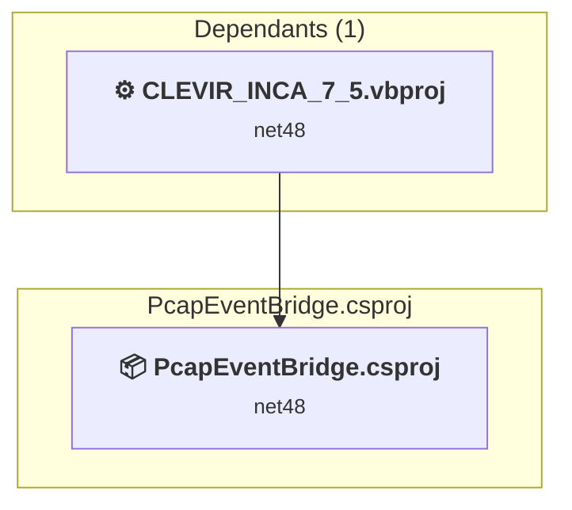

# Projects and dependencies analysis

This document provides a comprehensive overview of the projects and their dependencies in the context of upgrading to .NETCoreApp,Version=v10.0.

## Table of Contents

- [Executive Summary](#executive-Summary)
  - [Highlevel Metrics](#highlevel-metrics)
  - [Projects Compatibility](#projects-compatibility)
  - [Package Compatibility](#package-compatibility)
  - [API Compatibility](#api-compatibility)
  - [Binding Redirect Configuration](#binding-redirect-configuration)
- [Aggregate NuGet packages details](#aggregate-nuget-packages-details)
- [Top API Migration Challenges](#top-api-migration-challenges)
  - [Technologies and Features](#technologies-and-features)
  - [Most Frequent API Issues](#most-frequent-api-issues)
- [Projects Relationship Graph](#projects-relationship-graph)
- [Project Details](#project-details)

  - [C:\DEV\CLEVIR\CLEVIR_7.5 Installation\CLEVIR_Installer.wixproj](#c:devclevirclevir_75-installationclevir_installerwixproj)
  - [CLEVIR_INCA_7_5.vbproj](#clevir_inca_7_5vbproj)
  - [HesaiWrapper\HesaiWrapper\HesaiWrapper.vcxproj](#hesaiwrapperhesaiwrapperhesaiwrappervcxproj)
  - [PcapEventBridge\PcapEventBridge.csproj](#pcapeventbridgepcapeventbridgecsproj)

## Executive Summary

### Highlevel Metrics

| Metric | Count | Status |
| :--- | :---: | :--- |
| Total Projects | 4 | 3 require upgrade |
| Total NuGet Packages | 36 | 9 need upgrade |
| Total Code Files | 134 |  |
| Total Code Files with Incidents | 120 |  |
| Total Lines of Code | 95215 |  |
| Total Number of Issues | 53947 |  |
| Estimated LOC to modify | 53910+ | at least 56.6% of codebase |

### Projects Compatibility

| Project | Target Framework | Difficulty | Package Issues | API Issues | Binding Issues | Est. LOC Impact | Description |
| :--- | :---: | :---: | :---: | :---: | :---: | :---: | :--- |
| [C:\DEV\CLEVIR\CLEVIR_7.5 Installation\CLEVIR_Installer.wixproj](#c:devclevirclevir_75-installationclevir_installerwixproj) | native | 🟢 Low | 0 | 0 | 0 |  | DotNetCoreApp, Sdk Style = True |
| [CLEVIR_INCA_7_5.vbproj](#clevir_inca_7_5vbproj) | net48 | 🟡 Medium | 18 | 53910 | 15 | 53910+ | ClassicWinForms, Sdk Style = False |
| [HesaiWrapper\HesaiWrapper\HesaiWrapper.vcxproj](#hesaiwrapperhesaiwrapperhesaiwrappervcxproj) |  | ✅ None | 0 | 0 | 0 |  | ClassicClassLibrary, Sdk Style = False |
| [PcapEventBridge\PcapEventBridge.csproj](#pcapeventbridgepcapeventbridgecsproj) | net48 | 🟢 Low | 0 | 0 | 0 |  | ClassLibrary, Sdk Style = True |

### Package Compatibility

| Status | Count | Percentage |
| :--- | :---: | :---: |
| ✅ Compatible | 27 | 75.0% |
| ⚠️ Incompatible | 0 | 0.0% |
| 🔄 Upgrade Recommended | 9 | 25.0% |
| ***Total NuGet Packages*** | ***36*** | ***100%*** |

### API Compatibility

| Category | Count | Impact |
| :--- | :---: | :--- |
| 🔴 Binary Incompatible | 45607 | High - Require code changes |
| 🟡 Source Incompatible | 8300 | Medium - Needs re-compilation and potential conflicting API error fixing |
| 🔵 Behavioral change | 3 | Low - Behavioral changes that may require testing at runtime |
| ✅ Compatible | 80895 |  |
| ***Total APIs Analyzed*** | ***134805*** |  |

### Binding Redirect Configuration

| Severity | Count | Description |
| :--- | :---: | :--- |
| 🔴Mandatory | 7 | Must be fixed to avoid runtime failures |
| 🟡Potential | 8 | May cause issues in certain scenarios |
| ***Total Binding Issues*** | ***15*** | ***Across 1 project(s)*** |

## Aggregate NuGet packages details

| Package | Current Version | Suggested Version | Projects | Description |
| :--- | :---: | :---: | :--- | :--- |
| Azure.Core | 1.57.0 |  | [CLEVIR_INCA_7_5.vbproj](#clevir_inca_7_5vbproj) | ✅Compatible |
| Microsoft.Extensions.DependencyInjection.Abstractions | 11.0.0-preview.4.26230.115 | 10.0.9 | [CLEVIR_INCA_7_5.vbproj](#clevir_inca_7_5vbproj) | NuGet package upgrade is recommended |
| Microsoft.Extensions.Logging.Abstractions | 11.0.0-preview.4.26230.115 | 10.0.9 | [CLEVIR_INCA_7_5.vbproj](#clevir_inca_7_5vbproj) | NuGet package upgrade is recommended |
| Microsoft.NETCore.Platforms | 8.0.0-preview.7.23375.6 |  | [CLEVIR_INCA_7_5.vbproj](#clevir_inca_7_5vbproj) | NuGet package functionality is included with framework reference |
| Microsoft.NETCore.Targets | 6.0.0-preview.4.21253.7 |  | [CLEVIR_INCA_7_5.vbproj](#clevir_inca_7_5vbproj) | ✅Compatible |
| NAudio | 2.3.0 |  | [CLEVIR_INCA_7_5.vbproj](#clevir_inca_7_5vbproj) | ✅Compatible |
| NAudio.Asio | 2.3.0 |  | [CLEVIR_INCA_7_5.vbproj](#clevir_inca_7_5vbproj) | ✅Compatible |
| NAudio.Core | 2.3.0 |  | [CLEVIR_INCA_7_5.vbproj](#clevir_inca_7_5vbproj) | ✅Compatible |
| NAudio.Midi | 2.3.0 |  | [CLEVIR_INCA_7_5.vbproj](#clevir_inca_7_5vbproj) | ✅Compatible |
| NAudio.Wasapi | 2.3.0 |  | [CLEVIR_INCA_7_5.vbproj](#clevir_inca_7_5vbproj) | ✅Compatible |
| NAudio.WinForms | 2.3.0 |  | [CLEVIR_INCA_7_5.vbproj](#clevir_inca_7_5vbproj) | ✅Compatible |
| NAudio.WinMM | 2.3.0 |  | [CLEVIR_INCA_7_5.vbproj](#clevir_inca_7_5vbproj) | ✅Compatible |
| Newtonsoft.Json | 13.0.5-beta1 | 13.0.4 | [CLEVIR_INCA_7_5.vbproj](#clevir_inca_7_5vbproj) | NuGet package upgrade is recommended |
| PacketDotNet | 1.4.9-pre53 |  | [CLEVIR_INCA_7_5.vbproj](#clevir_inca_7_5vbproj) [PcapEventBridge.csproj](#pcapeventbridgepcapeventbridgecsproj) | ✅Compatible |
| runtime.native.System.IO.Compression | 4.3.2 |  | [CLEVIR_INCA_7_5.vbproj](#clevir_inca_7_5vbproj) | ✅Compatible |
| SharpPcap | 6.3.1 |  | [CLEVIR_INCA_7_5.vbproj](#clevir_inca_7_5vbproj) [PcapEventBridge.csproj](#pcapeventbridgepcapeventbridgecsproj) | ✅Compatible |
| SharpZipLib | 1.4.2 |  | [CLEVIR_INCA_7_5.vbproj](#clevir_inca_7_5vbproj) | ✅Compatible |
| System.Buffers | 4.6.1 |  | [CLEVIR_INCA_7_5.vbproj](#clevir_inca_7_5vbproj) | NuGet package functionality is included with framework reference |
| System.ClientModel | 1.13.0 |  | [CLEVIR_INCA_7_5.vbproj](#clevir_inca_7_5vbproj) | ✅Compatible |
| System.Diagnostics.DiagnosticSource | 11.0.0-preview.4.26230.115 | 10.0.9 | [CLEVIR_INCA_7_5.vbproj](#clevir_inca_7_5vbproj) | NuGet package upgrade is recommended |
| System.IO.Compression | 4.3.0 |  | [CLEVIR_INCA_7_5.vbproj](#clevir_inca_7_5vbproj) | NuGet package functionality is included with framework reference |
| System.IO.Compression.ZipFile | 4.3.0 |  | [CLEVIR_INCA_7_5.vbproj](#clevir_inca_7_5vbproj) | NuGet package functionality is included with framework reference |
| System.IO.Pipelines | 11.0.0-preview.4.26230.115 | 10.0.9 | [CLEVIR_INCA_7_5.vbproj](#clevir_inca_7_5vbproj) | NuGet package upgrade is recommended |
| System.Memory | 4.6.3 |  | [CLEVIR_INCA_7_5.vbproj](#clevir_inca_7_5vbproj) | NuGet package functionality is included with framework reference |
| System.Memory.Data | 11.0.0-preview.4.26230.115 | 10.0.9 | [CLEVIR_INCA_7_5.vbproj](#clevir_inca_7_5vbproj) | NuGet package upgrade is recommended |
| System.Numerics.Vectors | 4.6.1 |  | [CLEVIR_INCA_7_5.vbproj](#clevir_inca_7_5vbproj) | NuGet package functionality is included with framework reference |
| System.Runtime.CompilerServices.Unsafe | 6.1.2 |  | [CLEVIR_INCA_7_5.vbproj](#clevir_inca_7_5vbproj) | ✅Compatible |
| System.Security.AccessControl | 6.0.1 |  | [CLEVIR_INCA_7_5.vbproj](#clevir_inca_7_5vbproj) | ✅Compatible |
| System.Security.Principal.Windows | 5.0.0 |  | [CLEVIR_INCA_7_5.vbproj](#clevir_inca_7_5vbproj) | NuGet package functionality is included with framework reference |
| System.Text.Encoding.CodePages | 11.0.0-preview.4.26230.115 | 10.0.9 | [CLEVIR_INCA_7_5.vbproj](#clevir_inca_7_5vbproj) | NuGet package upgrade is recommended |
| System.Text.Encodings.Web | 11.0.0-preview.4.26230.115 | 10.0.9 | [CLEVIR_INCA_7_5.vbproj](#clevir_inca_7_5vbproj) | NuGet package upgrade is recommended |
| System.Text.Json | 11.0.0-preview.4.26230.115 | 10.0.9 | [CLEVIR_INCA_7_5.vbproj](#clevir_inca_7_5vbproj) | NuGet package upgrade is recommended |
| System.Threading.Tasks.Extensions | 4.6.3 |  | [CLEVIR_INCA_7_5.vbproj](#clevir_inca_7_5vbproj) | NuGet package functionality is included with framework reference |
| System.ValueTuple | 4.6.2 |  | [CLEVIR_INCA_7_5.vbproj](#clevir_inca_7_5vbproj) | NuGet package functionality is included with framework reference |
| WixToolset.Netfx.wixext | 6.0.2 |  | [CLEVIR_Installer.wixproj](#c:devclevirclevir_75-installationclevir_installerwixproj) | ✅Compatible |
| WixToolset.UI.wixext | 6.0.2 |  | [CLEVIR_Installer.wixproj](#c:devclevirclevir_75-installationclevir_installerwixproj) | ✅Compatible |

## Top API Migration Challenges

### Technologies and Features

| Technology | Issues | Percentage | Migration Path |
| :--- | :---: | :---: | :--- |
| Windows Forms | 44958 | 83.4% | Windows Forms APIs for building Windows desktop applications with traditional Forms-based UI that are available in .NET on Windows. Enable Windows Desktop support: Option 1 (Recommended): Target net9.0-windows; Option 2: Add <UseWindowsDesktop>true</UseWindowsDesktop>; Option 3 (Legacy): Use Microsoft.NET.Sdk.WindowsDesktop SDK. |
| GDI+ / System.Drawing | 7604 | 14.1% | System.Drawing APIs for 2D graphics, imaging, and printing that are available via NuGet package System.Drawing.Common. Note: Not recommended for server scenarios due to Windows dependencies; consider cross-platform alternatives like SkiaSharp or ImageSharp for new code. |
| Windows Forms Legacy Controls | 1431 | 2.7% | Legacy Windows Forms controls that have been removed from .NET Core/5+ including StatusBar, DataGrid, ContextMenu, MainMenu, MenuItem, and ToolBar. These controls were replaced by more modern alternatives. Use ToolStrip, MenuStrip, ContextMenuStrip, and DataGridView instead. |
| Speech & Voice Recognition | 113 | 0.2% | System.Speech APIs for speech recognition and synthesis that are not available in .NET Core/.NET. These Windows-specific APIs have been superseded by cloud-based services. Use Azure Cognitive Services Speech or other modern speech APIs. |
| Legacy Cryptography | 3 | 0.0% | Obsolete or insecure cryptographic algorithms that have been deprecated for security reasons. These algorithms are no longer considered secure by modern standards. Migrate to modern cryptographic APIs using secure algorithms. |
| Deprecated Remoting & Serialization | 3 | 0.0% | Legacy .NET Remoting, BinaryFormatter, and related serialization APIs that are deprecated and removed for security reasons. Remoting provided distributed object communication but had significant security vulnerabilities. Migrate to gRPC, HTTP APIs, or modern serialization (System.Text.Json, protobuf). |
| Legacy Configuration System | 2 | 0.0% | Legacy XML-based configuration system (app.config/web.config) that has been replaced by a more flexible configuration model in .NET Core. The old system was rigid and XML-based. Migrate to Microsoft.Extensions.Configuration with JSON/environment variables; use System.Configuration.ConfigurationManager NuGet package as interim bridge if needed. |

### Most Frequent API Issues

| API | Count | Percentage | Category |
| :--- | :---: | :---: | :--- |
| T:System.Windows.Forms.Label | 7540 | 14.0% | Binary Incompatible |
| T:System.Windows.Forms.Button | 2356 | 4.4% | Binary Incompatible |
| T:System.Windows.Forms.ListBox | 1370 | 2.5% | Binary Incompatible |
| T:System.Drawing.Font | 1328 | 2.5% | Source Incompatible |
| T:System.Drawing.FontStyle | 1238 | 2.3% | Source Incompatible |
| T:System.Drawing.ContentAlignment | 1236 | 2.3% | Source Incompatible |
| T:System.Windows.Forms.ToolStripMenuItem | 1187 | 2.2% | Binary Incompatible |
| P:System.Windows.Forms.Label.Text | 1172 | 2.2% | Binary Incompatible |
| T:System.Windows.Forms.BorderStyle | 1155 | 2.1% | Binary Incompatible |
| T:System.Drawing.GraphicsUnit | 1152 | 2.1% | Source Incompatible |
| T:System.Windows.Forms.GroupBox | 1140 | 2.1% | Binary Incompatible |
| P:System.Windows.Forms.Control.Name | 1051 | 1.9% | Binary Incompatible |
| T:System.Windows.Forms.Control.ControlCollection | 984 | 1.8% | Binary Incompatible |
| P:System.Windows.Forms.Control.Controls | 984 | 1.8% | Binary Incompatible |
| P:System.Windows.Forms.Control.Location | 972 | 1.8% | Binary Incompatible |
| P:System.Windows.Forms.Control.Size | 968 | 1.8% | Binary Incompatible |
| M:System.Windows.Forms.Control.ControlCollection.Add(System.Windows.Forms.Control) | 967 | 1.8% | Binary Incompatible |
| P:System.Windows.Forms.Control.TabIndex | 916 | 1.7% | Binary Incompatible |
| P:System.Windows.Forms.Control.Font | 613 | 1.1% | Binary Incompatible |
| T:System.Windows.Forms.RadioButton | 582 | 1.1% | Binary Incompatible |
| F:System.Drawing.GraphicsUnit.Point | 576 | 1.1% | Source Incompatible |
| M:System.Drawing.Font.#ctor(System.String,System.Single,System.Drawing.FontStyle,System.Drawing.GraphicsUnit,System.Byte) | 576 | 1.1% | Source Incompatible |
| P:System.Windows.Forms.Control.Visible | 566 | 1.0% | Binary Incompatible |
| T:System.Windows.Forms.ComboBox | 536 | 1.0% | Binary Incompatible |
| M:System.Windows.Forms.Label.#ctor | 533 | 1.0% | Binary Incompatible |
| T:System.Windows.Forms.CheckBox | 510 | 0.9% | Binary Incompatible |
| P:System.Windows.Forms.Control.BackColor | 506 | 0.9% | Binary Incompatible |
| F:System.Drawing.FontStyle.Bold | 477 | 0.9% | Source Incompatible |
| T:System.Windows.Forms.TextBox | 472 | 0.9% | Binary Incompatible |
| P:System.Windows.Forms.Control.Enabled | 454 | 0.8% | Binary Incompatible |
| P:System.Windows.Forms.Label.TextAlign | 402 | 0.7% | Binary Incompatible |
| T:System.Windows.Forms.ListBox.ObjectCollection | 389 | 0.7% | Binary Incompatible |
| P:System.Windows.Forms.ListBox.Items | 389 | 0.7% | Binary Incompatible |
| T:System.Windows.Forms.PictureBox | 386 | 0.7% | Binary Incompatible |
| T:Microsoft.VisualBasic.ApplicationServices.AssemblyInfo | 382 | 0.7% | Binary Incompatible |
| P:Microsoft.VisualBasic.ApplicationServices.ApplicationBase.Info | 382 | 0.7% | Binary Incompatible |
| P:System.Windows.Forms.Label.BorderStyle | 373 | 0.7% | Binary Incompatible |
| P:Microsoft.VisualBasic.ApplicationServices.AssemblyInfo.DirectoryPath | 345 | 0.6% | Binary Incompatible |
| T:System.Windows.Forms.AnchorStyles | 334 | 0.6% | Binary Incompatible |
| T:System.Windows.Forms.DialogResult | 317 | 0.6% | Binary Incompatible |
| P:System.Windows.Forms.ButtonBase.Text | 291 | 0.5% | Binary Incompatible |
| P:System.Windows.Forms.ToolStripMenuItem.Checked | 280 | 0.5% | Binary Incompatible |
| T:System.Windows.Forms.Padding | 278 | 0.5% | Binary Incompatible |
| T:System.Windows.Forms.Cursor | 243 | 0.5% | Binary Incompatible |
| F:System.Windows.Forms.BorderStyle.FixedSingle | 242 | 0.4% | Binary Incompatible |
| P:System.Windows.Forms.ButtonBase.UseVisualStyleBackColor | 219 | 0.4% | Binary Incompatible |
| P:System.Windows.Forms.Control.ForeColor | 195 | 0.4% | Binary Incompatible |
| P:System.Windows.Forms.Control.Width | 191 | 0.4% | Binary Incompatible |
| P:System.Windows.Forms.ComboBox.Text | 189 | 0.4% | Binary Incompatible |
| F:System.Drawing.ContentAlignment.MiddleCenter | 185 | 0.3% | Source Incompatible |

## Projects Relationship Graph

Legend:
📦 SDK-style project
⚙️ Classic project

## Project Details

### C:\DEV\CLEVIR\CLEVIR_7.5 Installation\CLEVIR_Installer.wixproj

#### Project Info

- **Current Target Framework:** native
- **Proposed Target Framework:** net10.0
- **SDK-style**: True
- **Project Kind:** DotNetCoreApp
- **Dependencies**: 2
- **Dependants**: 0
- **Number of Files**: 1
- **Number of Files with Incidents**: 1
- **Lines of Code**: 231
- **Estimated LOC to modify**: 0+ (at least 0.0% of the project)

#### Dependency Graph

Legend:
📦 SDK-style project
⚙️ Classic project

### API Compatibility

| Category | Count | Impact |
| :--- | :---: | :--- |
| 🔴 Binary Incompatible | 0 | High - Require code changes |
| 🟡 Source Incompatible | 0 | Medium - Needs re-compilation and potential conflicting API error fixing |
| 🔵 Behavioral change | 0 | Low - Behavioral changes that may require testing at runtime |
| ✅ Compatible | 0 |  |
| ***Total APIs Analyzed*** | ***0*** |  |

#### Project Package References

| Package | Type | Current Version | Suggested Version | Description |
| :--- | :---: | :---: | :---: | :--- |
| WixToolset.Netfx.wixext | Explicit | 6.0.2 |  | ✅Compatible |
| WixToolset.UI.wixext | Explicit | 6.0.2 |  | ✅Compatible |

### CLEVIR_INCA_7_5.vbproj

#### Project Info

- **Current Target Framework:** net48
- **Proposed Target Framework:** net10.0-windows
- **SDK-style**: False
- **Project Kind:** ClassicWinForms
- **Dependencies**: 1
- **Dependants**: 1
- **Number of Files**: 196
- **Number of Files with Incidents**: 118
- **Lines of Code**: 94921
- **Estimated LOC to modify**: 53910+ (at least 56.8% of the project)

#### Dependency Graph

Legend:
📦 SDK-style project
⚙️ Classic project

### API Compatibility

| Category | Count | Impact |
| :--- | :---: | :--- |
| 🔴 Binary Incompatible | 45607 | High - Require code changes |
| 🟡 Source Incompatible | 8300 | Medium - Needs re-compilation and potential conflicting API error fixing |
| 🔵 Behavioral change | 3 | Low - Behavioral changes that may require testing at runtime |
| ✅ Compatible | 80855 |  |
| ***Total APIs Analyzed*** | ***134765*** |  |

#### Binding Redirect Configuration

| Rule | Severity | Details | Recommendation |
| :--- | :---: | :--- | :--- |
| Missing binding redirect for referenced assembly | 🟡Potential | Manual redirects exist but none covers System.IO.Compression (referenced v4.2.0.0, package v4.3.0) | Add a binding redirect for the missing assembly. |
| Manual redirect conflicts with auto-generated version | 🔴Mandatory | Manual redirect for System.Runtime.CompilerServices.Unsafe targets 6.0.3.0 but auto-generation would target 6.1.2 (MSB3836 conflict) | Remove the conflicting manual binding redirect or disable auto-generation. |
| Manual redirect conflicts with auto-generated version | 🔴Mandatory | Manual redirect for System.Buffers targets 4.0.5.0 but auto-generation would target 4.6.1 (MSB3836 conflict) | Remove the conflicting manual binding redirect or disable auto-generation. |
| Manual redirect conflicts with auto-generated version | 🔴Mandatory | Manual redirect for System.Memory targets 4.0.5.0 but auto-generation would target 4.6.3 (MSB3836 conflict) | Remove the conflicting manual binding redirect or disable auto-generation. |
| Manual redirect conflicts with auto-generated version | 🔴Mandatory | Manual redirect for System.Threading.Tasks.Extensions targets 4.2.4.0 but auto-generation would target 4.6.3 (MSB3836 conflict) | Remove the conflicting manual binding redirect or disable auto-generation. |
| Manual redirect conflicts with auto-generated version | 🔴Mandatory | Manual redirect for Azure.Core targets 1.51.1.0 but auto-generation would target 1.57.0 (MSB3836 conflict) | Remove the conflicting manual binding redirect or disable auto-generation. |
| Manual redirect conflicts with auto-generated version | 🔴Mandatory | Manual redirect for System.Numerics.Vectors targets 4.1.6.0 but auto-generation would target 4.6.1 (MSB3836 conflict) | Remove the conflicting manual binding redirect or disable auto-generation. |
| Manual redirect conflicts with auto-generated version | 🔴Mandatory | Manual redirect for System.Security.AccessControl targets 6.0.0.1 but auto-generation would target 6.0.1 (MSB3836 conflict) | Remove the conflicting manual binding redirect or disable auto-generation. |
| Binding redirect forces version downgrade | 🟡Potential | Binding redirect for Azure.Core targets 1.51.1.0 but package provides 1.57.0 | Update the binding redirect newVersion to match the version provided by the NuGet package. |
| Binding redirect forces version downgrade | 🟡Potential | Binding redirect for System.Buffers targets 4.0.5.0 but package provides 4.6.1 | Update the binding redirect newVersion to match the version provided by the NuGet package. |
| Binding redirect forces version downgrade | 🟡Potential | Binding redirect for System.Memory targets 4.0.5.0 but package provides 4.6.3 | Update the binding redirect newVersion to match the version provided by the NuGet package. |
| Binding redirect forces version downgrade | 🟡Potential | Binding redirect for System.Numerics.Vectors targets 4.1.6.0 but package provides 4.6.1 | Update the binding redirect newVersion to match the version provided by the NuGet package. |
| Binding redirect forces version downgrade | 🟡Potential | Binding redirect for System.Runtime.CompilerServices.Unsafe targets 6.0.3.0 but package provides 6.1.2 | Update the binding redirect newVersion to match the version provided by the NuGet package. |
| Binding redirect forces version downgrade | 🟡Potential | Binding redirect for System.Security.AccessControl targets 6.0.0.1 but package provides 6.0.1 | Update the binding redirect newVersion to match the version provided by the NuGet package. |
| Binding redirect forces version downgrade | 🟡Potential | Binding redirect for System.Threading.Tasks.Extensions targets 4.2.4.0 but package provides 4.6.3 | Update the binding redirect newVersion to match the version provided by the NuGet package. |

#### Project Technologies and Features

| Technology | Issues | Percentage | Migration Path |
| :--- | :---: | :---: | :--- |
| Legacy Configuration System | 2 | 0.0% | Legacy XML-based configuration system (app.config/web.config) that has been replaced by a more flexible configuration model in .NET Core. The old system was rigid and XML-based. Migrate to Microsoft.Extensions.Configuration with JSON/environment variables; use System.Configuration.ConfigurationManager NuGet package as interim bridge if needed. |
| Legacy Cryptography | 3 | 0.0% | Obsolete or insecure cryptographic algorithms that have been deprecated for security reasons. These algorithms are no longer considered secure by modern standards. Migrate to modern cryptographic APIs using secure algorithms. |
| Deprecated Remoting & Serialization | 3 | 0.0% | Legacy .NET Remoting, BinaryFormatter, and related serialization APIs that are deprecated and removed for security reasons. Remoting provided distributed object communication but had significant security vulnerabilities. Migrate to gRPC, HTTP APIs, or modern serialization (System.Text.Json, protobuf). |
| Speech & Voice Recognition | 113 | 0.2% | System.Speech APIs for speech recognition and synthesis that are not available in .NET Core/.NET. These Windows-specific APIs have been superseded by cloud-based services. Use Azure Cognitive Services Speech or other modern speech APIs. |
| Windows Forms Legacy Controls | 1431 | 2.7% | Legacy Windows Forms controls that have been removed from .NET Core/5+ including StatusBar, DataGrid, ContextMenu, MainMenu, MenuItem, and ToolBar. These controls were replaced by more modern alternatives. Use ToolStrip, MenuStrip, ContextMenuStrip, and DataGridView instead. |
| GDI+ / System.Drawing | 7604 | 14.1% | System.Drawing APIs for 2D graphics, imaging, and printing that are available via NuGet package System.Drawing.Common. Note: Not recommended for server scenarios due to Windows dependencies; consider cross-platform alternatives like SkiaSharp or ImageSharp for new code. |
| Windows Forms | 44958 | 83.4% | Windows Forms APIs for building Windows desktop applications with traditional Forms-based UI that are available in .NET on Windows. Enable Windows Desktop support: Option 1 (Recommended): Target net9.0-windows; Option 2: Add <UseWindowsDesktop>true</UseWindowsDesktop>; Option 3 (Legacy): Use Microsoft.NET.Sdk.WindowsDesktop SDK. |

### HesaiWrapper\HesaiWrapper\HesaiWrapper.vcxproj

#### Project Info

- **Current Target Framework:** ✅
- **SDK-style**: False
- **Project Kind:** ClassicClassLibrary
- **Dependencies**: 0
- **Dependants**: 1
- **Number of Files**: 0
- **Lines of Code**: 0
- **Estimated LOC to modify**: 0+ (at least 0.0% of the project)

#### Dependency Graph

Legend:
📦 SDK-style project
⚙️ Classic project

### API Compatibility

| Category | Count | Impact |
| :--- | :---: | :--- |
| 🔴 Binary Incompatible | 0 | High - Require code changes |
| 🟡 Source Incompatible | 0 | Medium - Needs re-compilation and potential conflicting API error fixing |
| 🔵 Behavioral change | 0 | Low - Behavioral changes that may require testing at runtime |
| ✅ Compatible | 0 |  |
| ***Total APIs Analyzed*** | ***0*** |  |

### PcapEventBridge\PcapEventBridge.csproj

#### Project Info

- **Current Target Framework:** net48
- **Proposed Target Framework:** net10.0
- **SDK-style**: True
- **Project Kind:** ClassLibrary
- **Dependencies**: 0
- **Dependants**: 1
- **Number of Files**: 1
- **Number of Files with Incidents**: 1
- **Lines of Code**: 63
- **Estimated LOC to modify**: 0+ (at least 0.0% of the project)

#### Dependency Graph

Legend:
📦 SDK-style project
⚙️ Classic project

### API Compatibility

| Category | Count | Impact |
| :--- | :---: | :--- |
| 🔴 Binary Incompatible | 0 | High - Require code changes |
| 🟡 Source Incompatible | 0 | Medium - Needs re-compilation and potential conflicting API error fixing |
| 🔵 Behavioral change | 0 | Low - Behavioral changes that may require testing at runtime |
| ✅ Compatible | 40 |  |
| ***Total APIs Analyzed*** | ***40*** |  |

